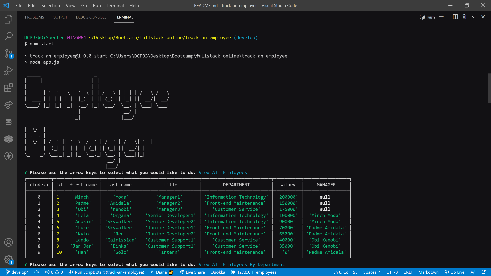
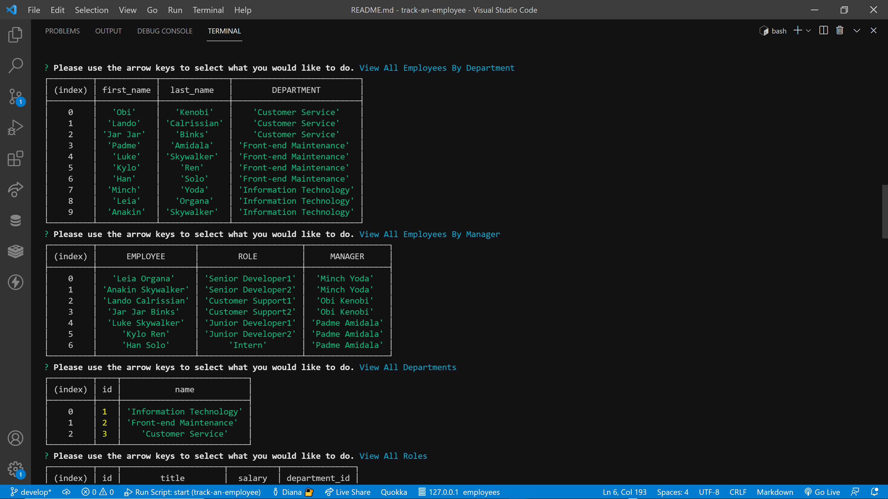
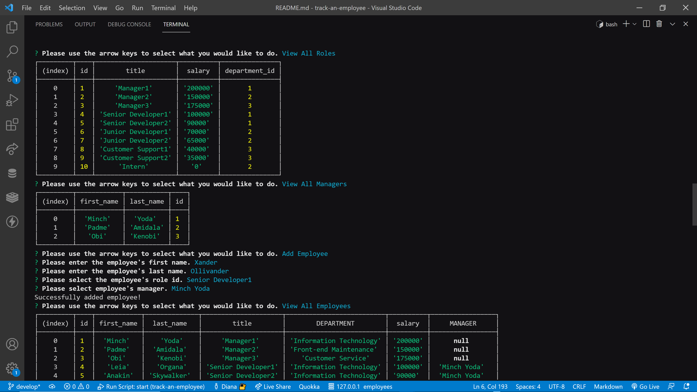
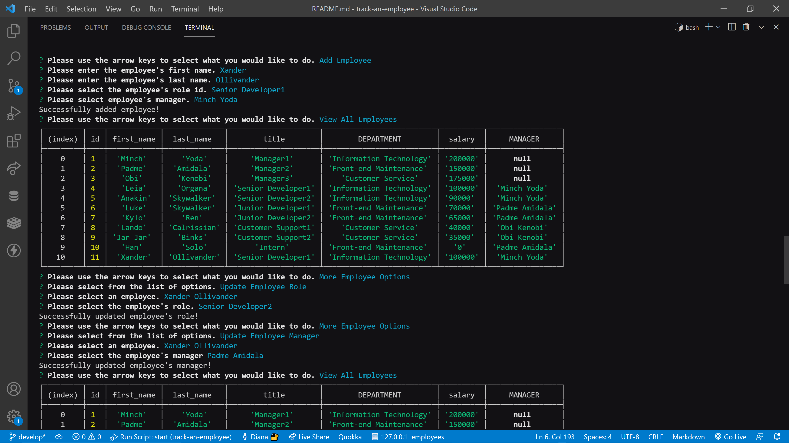
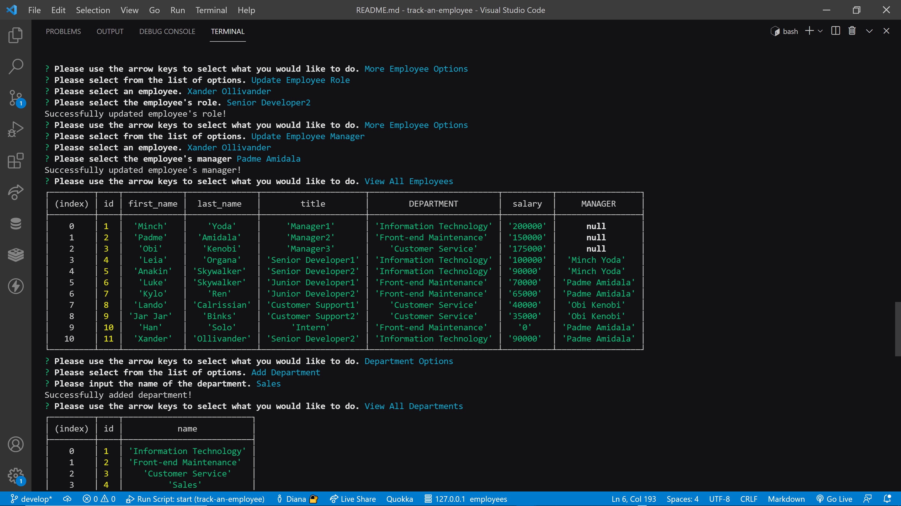
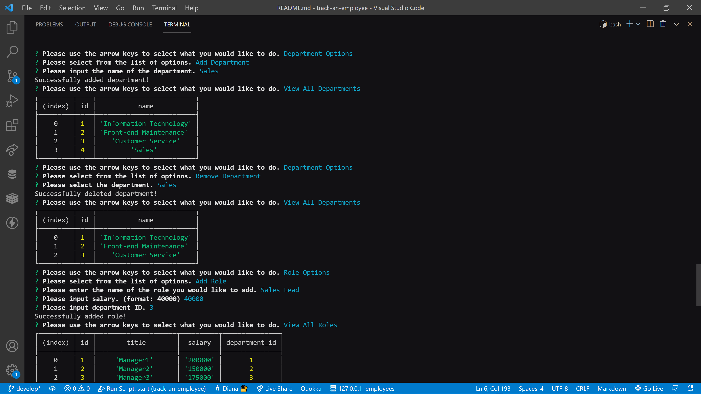
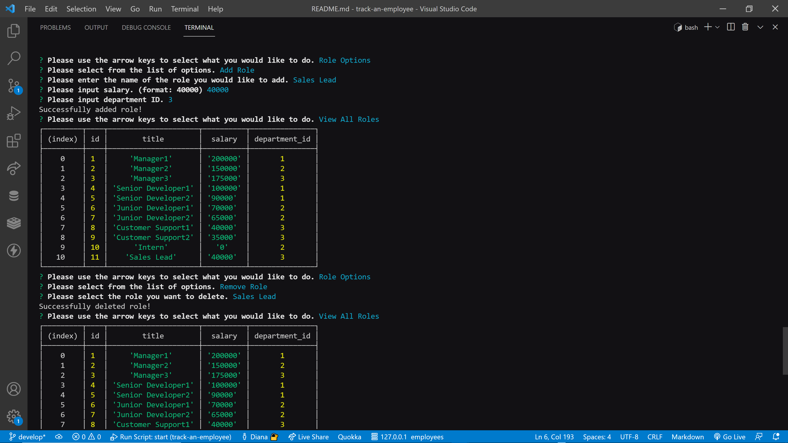
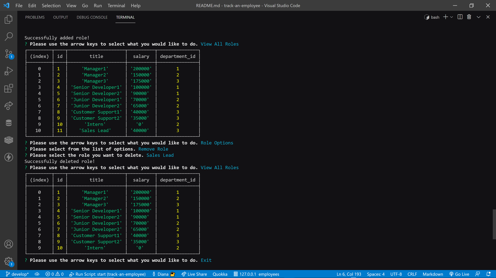

# track-an-employee


## Description

For challenge 12 of the UM Coding Bootcamp, I had to use Node.js, Inquirer, and MySQL to create a content management system (CMS) command-line application that allows companies to view and manage their employee database.


## Table of Contents

* [Mock-Up](#mock-up)

* [Built-With](#built-with)

* [Installation](#installation)

* [Usage](#usage)

* [License](#license)

* [Contributing](#contributing)

* [Questions](#questions)

* [Walkthrough-Video](#walkthrough-video)

* [Repository](#repository)


## Mock-Up











## Built-With

NodeJS, Inquirer, MySQL, JavaScript


## Installation

To install necessary dependencies, run the following command:
```md
npm i
```

## Usage

To use this application, run the following command:
```md
npm start
```

## License

This project is licensed under the GNU GPLv3 license.


## Contributing

Please contact the owner of the repository if you would like to contribute.


## Questions

If you have any questions about the repo, open an issue or contact me directly at salasd10418@gmail.com. You can find more of my work at [Github](https://github.com/salasd93).


## Walkthrough Video

https://drive.google.com/file/d/1DjCd3MB5YmIK4a1MVjR3wgVK5-YFWQM3/view


## Repository

https://github.com/SalasD93/track-an-employee